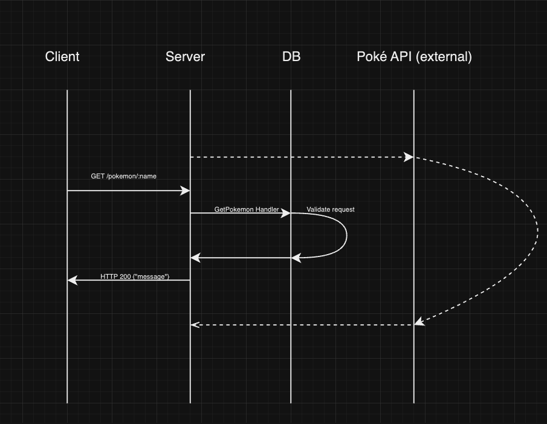

## PokéDex

The pokédex archives data on pokémon caught or encountered in the wild. This particular pokédex checks its internal memory for data on a previously encountered pokémon, should that data be missing, the pokedex makes a request to the pokémon API to fill in the blanks.

The flow path for the requests looks something like this:

Running the program:
- Set up a mongo db instance. The default connection uri can be modified in the source file before building the binary object.
- Run the build command: `go build main.go`.
- Run the program `./main.go`
- The server should be listening on port `3000`.